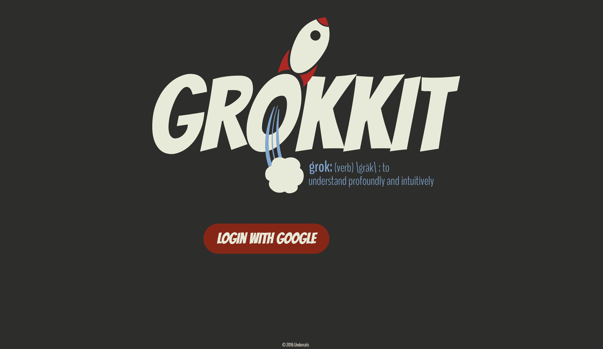
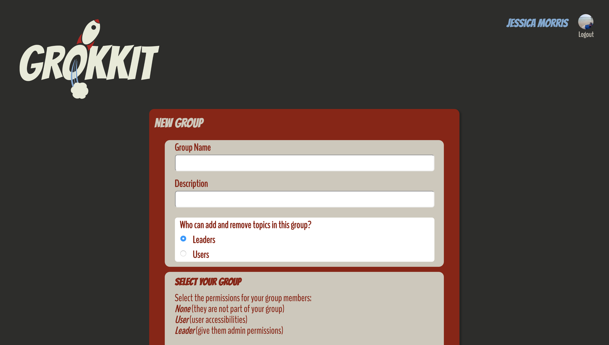
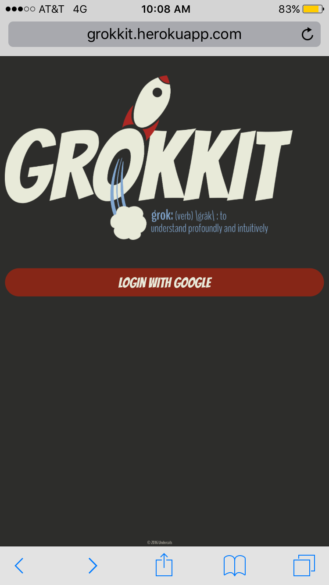
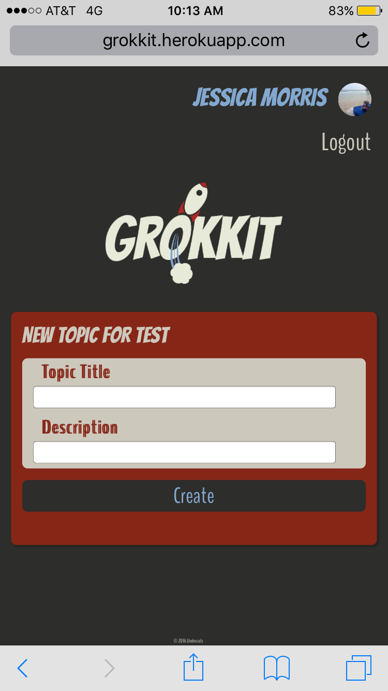
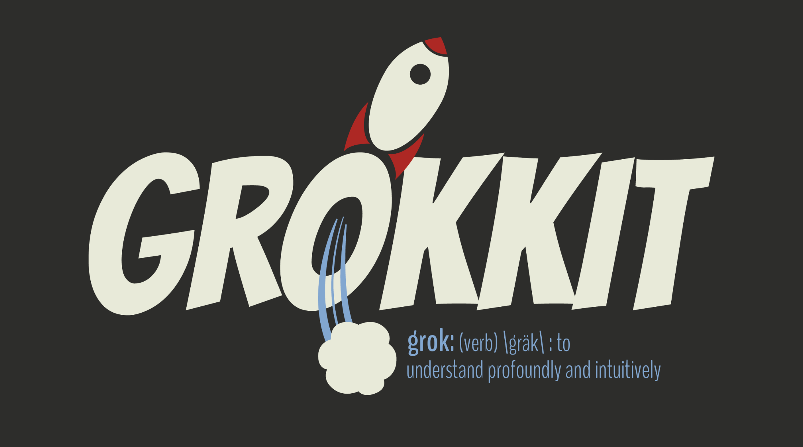

# Grokkit
Grokkit is a Learning Tracker for Instructors.

Grokkit is designed as a tool for Leaders to track the understanding of the members of their group. Leaders may create Groups (ex: a study group for a history test) and add Users to those groups. Leaders can then decide what permissions Users have. A Group may have multiple Leaders, and, depending on the permissions chosen, Users and Leaders can create Topics within the Group. Users may then click on a Topic and rate their understanding on a scale of 0-10. There is an option for the User to comment. The comments will only be seen by the Leader(s). The purpose of this app is to promote communication between Leaders and Users, so as to increase a User's understanding of certain Topics.

Grokkit is mobile-friendly as well:

The Grokkit logo was created in Adobe Illustrator by Jess Morris.

Our group focused on "user-friendly" when we considered the design. We used HTML/CSS, Bootstrap, JavaScript; our API is Google Charts. The OAuth is handled with Google Plus. As a group, we prioritized communication and found that that significantly contributed to a positive workflow.
